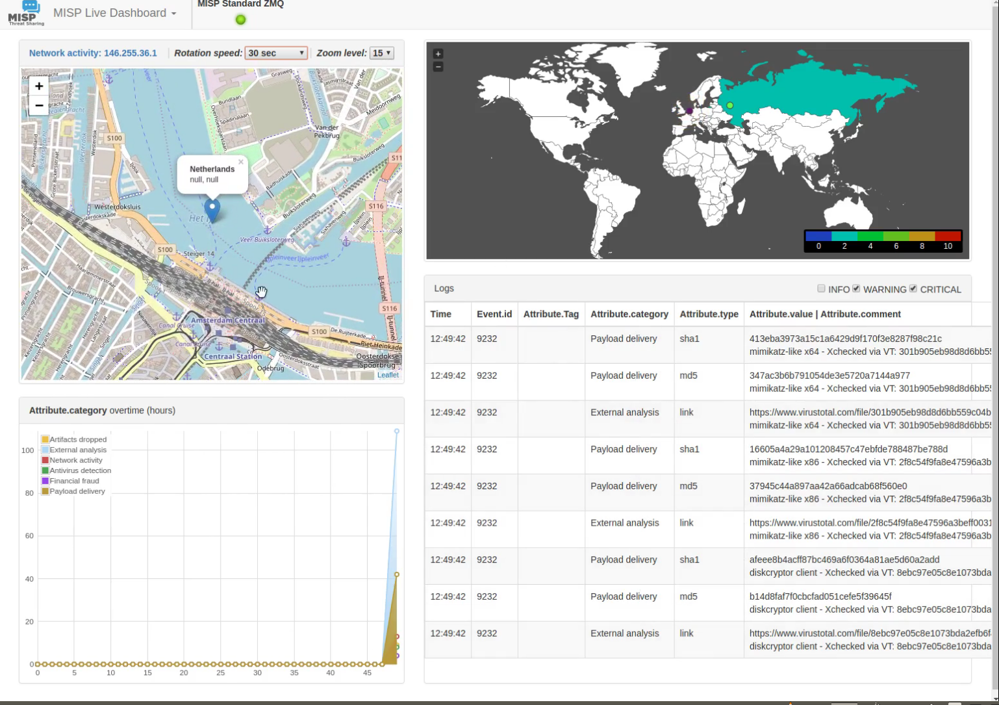
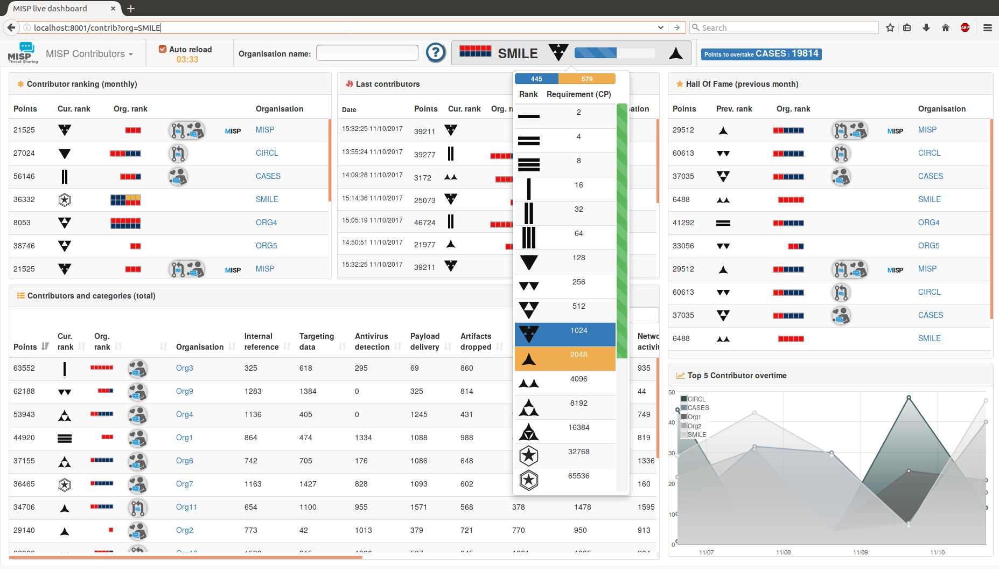
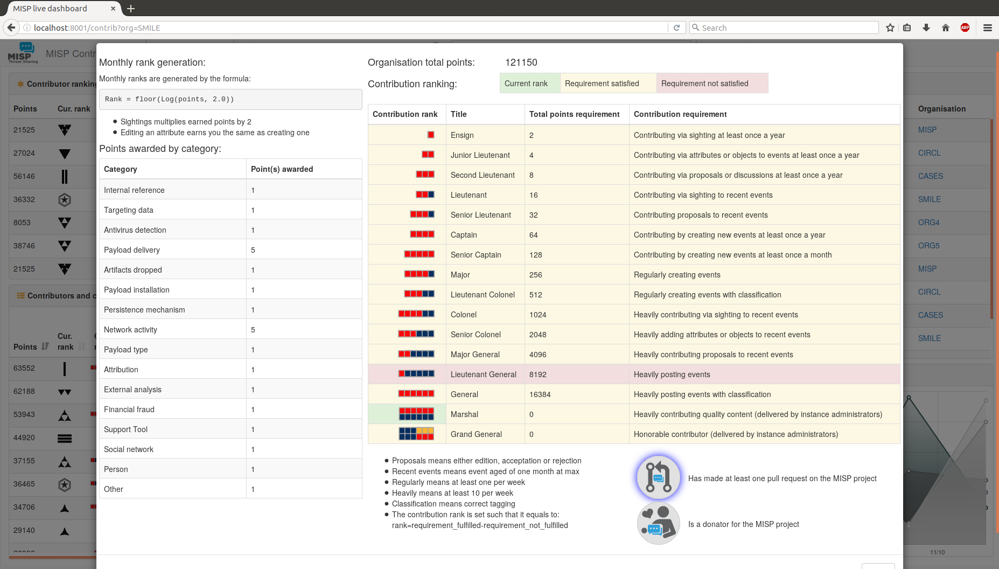
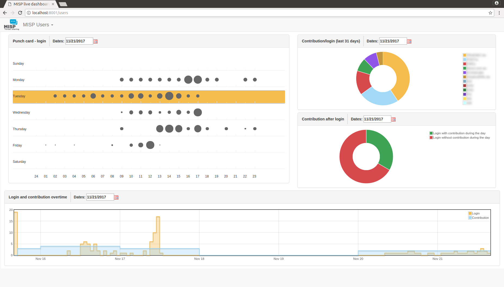
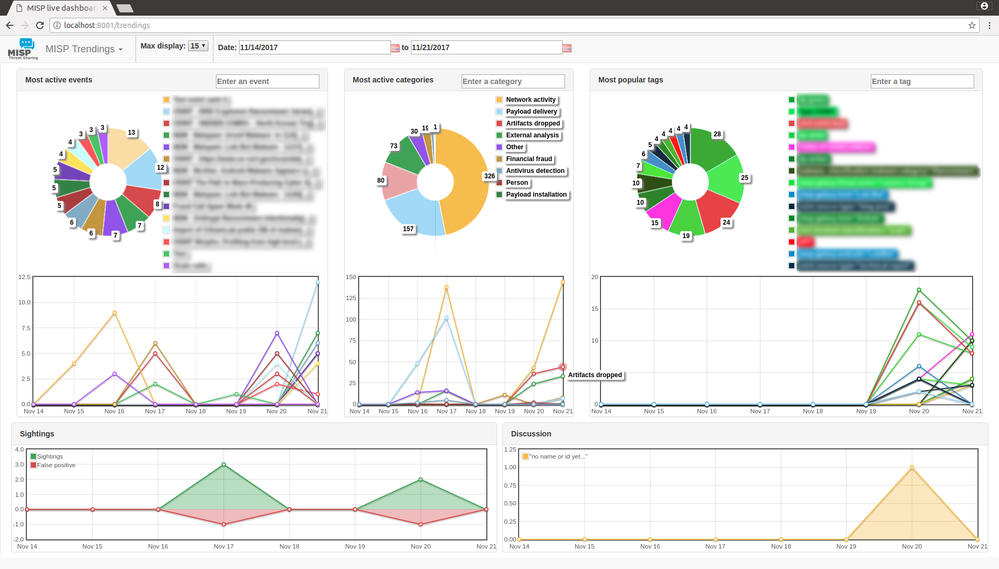

# MISP-Dashboard
An experimental dashboard showing live data and statistics from the ZMQ of one or more MISP instances.


# Installation
- Launch ```./install_dependencies.sh``` from the MISP-Dashboard directory
- Update the configuration file ```config.cfg``` so that it matches your system
  - Fields that you may change:
    - RedisGlobal -> host
    - RedisGlobal -> port
    - RedisGlobal -> zmq_url
    - RedisGlobal -> misp_web_url
    - RedisMap    -> pathMaxMindDB

# Updating by pulling
- Re-launch ```./install_dependencies.sh``` to fetch new required dependencies
- Re-update your configuration file ```config.cfg```

# Starting the System
- Be sure to have a running redis server
    - e.g. ```redis-server -p 6250```
- Activate your virtualenv ```. ./DASHENV/bin/activate```
- Listen to the MISP feed by starting the zmq_subscriber ```./zmq_subscriber.py```
- Start the dispatcher to process received messages ```./zmq_dispatcher.py```
- Start the Flask server ```./server.py```
- Access the interface at ```http://localhost:8001/```

# Features

## Live Dashboard
- Possibility to subscribe to multiple ZMQ feeds
- Shows direct contribution made by organisations
- Shows live resolvable posted locations



## Geolocalisation Dashboard

- Provides historical geolocalised information to support security teams, CSIRTs or SOC finding threats in their constituency
- Possibility to get geospatial information from specific regions


## Contributors Dashboard

__Shows__:
- The monthly rank of all organisation
- The last organisation that contributed (dynamic updates)
- The contribution level of all organisation
- Each category of contribution per organisation
- The current ranking of the selected organisation (dynamic updates)

__Includes__:

- Gamification of the platform:
  - Two different levels of ranking with unique icons
  - Exclusive obtainable badges for source code contributors and donator




## Users Dashboard

- Shows when and how the platform is used:
    - Login punchcard and overtime
    - Contribution vs login



## Trendings Dashboard

- Provides real time information to support security teams, CSIRTs or SOC showing current threats and activity
    - Shows most active events, categories and tags
    - Shows sightings and discussion overtime



# zmq_subscriber options
```usage: zmq_subscriber.py [-h] [-n ZMQNAME] [-u ZMQURL]

A zmq subscriber. It subscribe to a ZMQ then redispatch it to the MISP-dashboard

optional arguments:
  -h, --help            show this help message and exit
  -n ZMQNAME, --name ZMQNAME
                        The ZMQ feed name
  -u ZMQURL, --url ZMQURL
                        The URL to connect to
```

## Deploy in production using mod_wsgi

Install Apache's mod-wsgi for Python3

```bash
sudo apt-get install libapache2-mod-wsgi-py3
```

Caveat: If you already have mod-wsgi installed for Python2, it will be replaced!

```bash
The following packages will be REMOVED:
  libapache2-mod-wsgi
The following NEW packages will be installed:
  libapache2-mod-wsgi-py3
```

Configuration file `/etc/apache2/sites-available/misp-dashboard.conf` assumes that `misp-dashboard` is cloned into `var/www/misp-dashboard`. It runs as user `misp` in this example. Change the permissions to folder and files accordingly.

```
<VirtualHost *:8000>
    ServerAdmin admin@misp.local
    ServerName misp.local

    DocumentRoot /var/www/misp-dashboard
    WSGIDaemonProcess misp-dashboard user=misp group=misp threads=5 python-home=/var/www/misp-dashboard/DASHENV
    WSGIScriptAlias / /var/www/misp-dashboard/misp-dashboard.wsgi

    <Directory /var/www/misp-dashboard>
        WSGIProcessGroup misp-dashboard
        WSGIApplicationGroup %{GLOBAL}
        Require all granted
    </Directory>

    LogLevel info
    ErrorLog /var/log/apache2/misp-dashboard.local_error.log
    CustomLog /var/log/apache2/misp-dashboard.local_access.log combined
    ServerSignature Off
</VirtualHost>
```

# License
Images and logos are handmade for:
- rankingMISPOrg/
- rankingMISPMonthly/
- MISPHonorableIcons/

Note that:
- Part of ```MISPHonorableIcons/1.svg``` comes from [octicons.github.com](https://octicons.github.com/icon/git-pull-request/) (CC0 - No Rights Reserved)
- Part of ```MISPHonorableIcons/2.svg``` comes from [Zeptozephyr](https://zeptozephyr.deviantart.com/art/Vectored-Portal-Icons-207347804) (CC0 - No Rights Reserved)

```
Copyright (C) 2017 CIRCL - Computer Incident Response Center Luxembourg (c/o smile, security made in Lëtzebuerg, Groupement d'Intérêt Economique)
Copyright (c) 2017 Sami Mokaddem


This program is free software: you can redistribute it and/or modify
it under the terms of the GNU Affero General Public License as published by
the Free Software Foundation, either version 3 of the License, or
(at your option) any later version.

This program is distributed in the hope that it will be useful,
but WITHOUT ANY WARRANTY; without even the implied warranty of
MERCHANTABILITY or FITNESS FOR A PARTICULAR PURPOSE.  See the
GNU Affero General Public License for more details.

You should have received a copy of the GNU Affero General Public License
along with this program.  If not, see <http://www.gnu.org/licenses/>.
```
